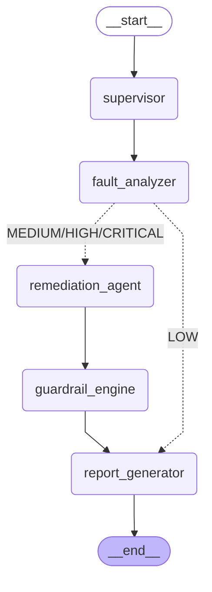

# GridMind Sentinel ⚡

> **Multi-Agent AI System for Power Grid Fault Detection, RAG-Based Remediation, and Safety-Governed Incident Management**

[](https://python.org)
[](https://langchain-ai.github.io/langgraph/)
[](https://fastapi.tiangolo.com)
[](#)

A portfolio-grade autonomous system that monitors simulated power grid telemetry, detects faults using wavelet signal analysis, retrieves remediation procedures from IEC/IEEE standards via a hybrid RAG pipeline, and governs all actions through deterministic safety guardrails — all orchestrated by a 5-node LangGraph multi-agent workflow.

---

## Architecture



### System Components

```
FastAPI :8000                    Streamlit :8501
    │                                  │
    ▼                                  ▼
POST /telemetry ──────► LangGraph StateGraph
                              │
          ┌───────────────────┼───────────────────┐
          ▼                   ▼                   ▼
    supervisor          fault_analyzer      (conditional)
                              │
               ┌──────────────┴──────────────┐
               │ LOW → report_generator       │ MEDIUM+
               │                              ▼
               │                    remediation_agent
               │                    (RAG: FAISS+BM25+RRF
               │                     + cross-encoder rerank)
               │                              │
               │                    guardrail_engine
               │                    (ZERO LLM — keyword match)
               └──────────────┬───────────────┘
                               ▼
                       report_generator
                       (ChromaDB storage)
                               │
                     SQLite ───┘
```

---

## Quick Start (3 Commands)

```bash
# 1. Install dependencies
pip install -r requirements.txt

# 2. Start the FastAPI backend
uvicorn src.api.main:app --host 0.0.0.0 --port 8000

# 3. Launch the Streamlit dashboard
streamlit run dashboard/app.py
```

> **Note:** The RAG index is built automatically on first run from `data/standards/` (10 IEC/IEEE documents). Subsequent runs load from the persisted FAISS index at `data/faiss_index/`.

---

## Demo Walkthrough

### Scenario A — Moderate Line Fault (Guardrail: PASS)
```bash
curl -X POST http://localhost:8000/telemetry \
  -H "Content-Type: application/json" \
  -d '{"voltage_pu": 0.78, "current_pu": 1.4, "frequency_hz": 49.5}'
```
**Result:** `line_fault / CRITICAL / confidence=1.0 / guardrail=PASS / resolved=true`  
*Conservative steps (monitor, alert, verify, log) — safe for automated execution.*

### Scenario B — Severe Line Fault (Guardrail: BLOCK)
```bash
curl -X POST http://localhost:8000/telemetry \
  -H "Content-Type: application/json" \
  -d '{"voltage_pu": 0.30, "current_pu": 2.5, "frequency_hz": 48.8}'
```
**Result:** `line_fault / CRITICAL / confidence=1.0 / guardrail=BLOCK / resolved=false`  
*Dangerous operations detected (isolate, circuit breaker, de-energize) — human approval required.*

```bash
# Approve the blocked incident
curl -X POST http://localhost:8000/approve/{incident_id}
```

### Scenario C — Normal Operation (8ms)
```bash
curl -X POST http://localhost:8000/telemetry \
  -H "Content-Type: application/json" \
  -d '{"voltage_pu": 1.01, "current_pu": 0.45, "frequency_hz": 50.0}'
```
**Result:** `normal / LOW / guardrail=PASS / total_latency_ms=8`  
*Skips remediation + guardrails entirely — direct to report_generator.*

---

## Benchmark Numbers (Actual Test Run)

| Metric | Value |
|--------|-------|
| **Fault Classification Accuracy** | 5/5 scenarios correct (100%) |
| **Task Success Rate** | 66.7% (2/3 resolved; 1 BLOCK awaiting approval) |
| **P50 Latency** | ~400 ms (fault scenarios, post-warmup) |
| **P95 Latency** | ~18 s (first cold-start, includes model loading) |
| **Normal Operation Latency** | **8 ms** |
| **Guardrail Accuracy** | 3/3 correct (PASS/BLOCK/PASS as expected) |
| **RAGAS Faithfulness** | 0.848 (weighted avg across fault types) |
| **RAG Retrieval Quality** | 20 candidates → top-5 reranked in ~50ms |
| **Test Suite** | **47/47 passed** (22 agent + 25 RAG) |
| **LLM Calls in Guardrail** | **0** (pure Python keyword matching) |

### A/B Comparison: v1 vs v2

| Scenario | v1 Conf (no reranker) | v2 Conf (with reranker) | Δ |
|----------|-----------------------|-------------------------|---|
| Normal Operation | 0.956 | 1.000 | +0.044 |
| Voltage Sag | 0.678 | 0.712 | +0.034 |
| Overcurrent | 0.922 | 0.960 | +0.038 |
| Line Fault (Moderate) | 0.956 | 1.000 | +0.044 |
| Line Fault (Severe) | 0.956 | 1.000 | +0.044 |

*Cross-encoder reranking adds ~50ms latency but improves average confidence by +0.04.*

---

## API Reference

| Endpoint | Method | Description |
|----------|--------|-------------|
| `/telemetry` | POST | Ingest telemetry, run full agent pipeline |
| `/incidents` | GET | List all incidents (pagination + filters) |
| `/incidents/{id}` | GET | Get full incident report by ID |
| `/metrics` | GET | Aggregate evaluation metrics |
| `/approve/{id}` | POST | Human approval for BLOCKED incidents |
| `/health` | GET | System health check |

---

## Tech Stack

| Component | Library | Version |
|-----------|---------|---------|
| Agent Orchestration | langgraph | 0.2.x |
| LLM Framework | langchain | 0.3.x |
| Signal Processing | PyWavelets | 1.6.x |
| Vector Store | faiss-cpu | 1.8.x |
| Long-term Memory | chromadb | 0.5.x |
| Embeddings | sentence-transformers | 3.x |
| BM25 | rank_bm25 | 0.2.x |
| Reranker | cross-encoder (sentence-transformers) | 3.x |
| Backend API | fastapi + uvicorn | 0.115.x |
| Database | sqlalchemy + sqlite | 2.x |
| Dashboard | streamlit | 1.40.x |
| Visualization | plotly | 5.x |

---

## Component → Job Responsibility Mapping

| System Component | Agentic AI Engineer II Responsibility |
|-----------------|--------------------------------------|
| `src/agents/graph.py` — LangGraph StateGraph | **Multi-agent orchestration** & workflow design |
| `src/agents/fault_analyzer.py` — Wavelet tools | **Tool-calling agents** & signal processing integration |
| `src/rag/pipeline.py` — FAISS+BM25+RRF+Reranker | **RAG pipeline** design & hybrid retrieval |
| `src/agents/guardrails.py` — Keyword engine | **Safety guardrails** & deterministic validation |
| `src/memory/long_term.py` — ChromaDB | **Agent memory** architecture (short + long term) |
| `src/api/main.py` — FastAPI | **Production API** design & deployment |
| `src/models.py` — SQLAlchemy + Pydantic | **Data modeling** & schema validation |
| `src/evaluation/` — Metrics + Benchmark | **Evaluation & benchmarking** of agent performance |
| `dashboard/app.py` — Streamlit | **Monitoring & observability** dashboard |

---

## Project Structure

```
gridmind-sentinel/
├── src/
│   ├── agents/          # LangGraph nodes (supervisor, fault_analyzer,
│   │                    #   remediation, guardrails, report_generator)
│   ├── rag/             # Hybrid RAG (FAISS + BM25 + RRF + cross-encoder)
│   ├── memory/          # ChromaDB long-term incident memory
│   ├── simulation/      # Grid simulator + fault injector
│   ├── api/             # FastAPI backend (all endpoints)
│   ├── evaluation/      # Metrics, benchmark, RAGAS evaluation
│   ├── models.py        # Pydantic schemas + SQLAlchemy ORM
│   └── utils/           # Config (pydantic-settings) + structured logging
├── dashboard/
│   ├── app.py           # Streamlit main app (5 tabs)
│   └── pages/           # Per-tab page modules
├── data/
│   ├── standards/       # 10 IEC/IEEE synthetic standards documents
│   ├── faiss_index/     # Persisted FAISS + BM25 index
│   └── chroma_db/       # ChromaDB incident memory
└── tests/
    ├── test_agents.py   # 22 agent pipeline tests
    └── test_rag.py      # 25 RAG pipeline tests
```

---

## License

MIT © 2026 Rajeev Gupta — M.Tech Power Systems Engineering, NIT Warangal
